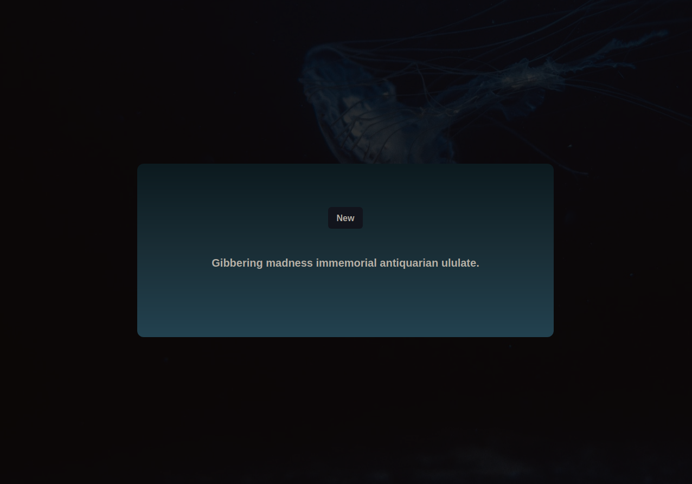

# R4ndom Front-end on React

> This app fetches random phrases from my Rails API.

## Built With

- React
- Chakra-UI
- Redux and Redux/Toolkit

## Live Demo

[Live Demo Link](https://r4ndom-frontend.netlify.app/)

## Getting Started

**This is an example of how you may give instructions on setting up your project locally.**
**Modify this file to match your project, remove sections that don't apply. For example: delete the testing section if the currect project doesn't require testing.**

To get a local copy up and running follow these simple example steps.

### Prerequisites

- Node
- Git

### Setup

- Clone this repo
- CD to folder
- Run `npm i` or `yarn i`

### Usage

- Run `npm run start` to start the development server.

## Authors

👤 **Daniel Jaramillo**

- GitHub: [@d4nielj](https://github.com/d4nielj)
- Twitter: [@d4niel_jm](https://twitter.com/d4niel_jm)
- LinkedIn: [d4nielj](https://linkedin.com/in/d4nielj)

## 🤝 Contributing

Contributions, issues, and feature requests are welcome!

Feel free to check the [issues page](../../issues/).

## Show your support

Give a ⭐️ if you like this project!

## 📝 License

This project is [MIT](./LICENSE) licensed.
